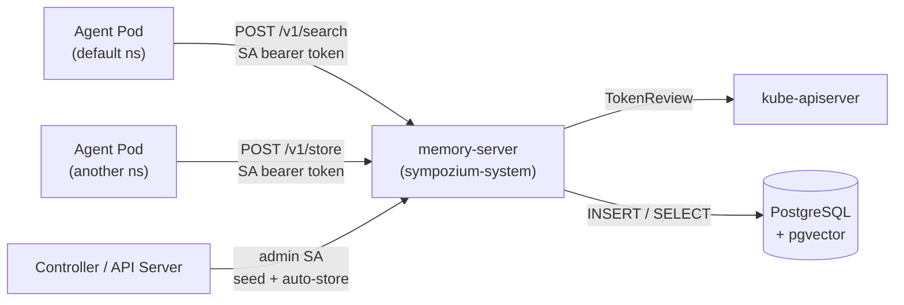

# Persistent Memory

Sympozium runs a **single, central memory server** for the whole cluster — `sympozium-memory-server` in the `sympozium-system` namespace. It stores agent and ensemble memory as rows in PostgreSQL with the [`pgvector`](https://github.com/pgvector/pgvector) extension, and serves hybrid (vector + full-text) retrieval over an HTTP API.

There is **no per-instance memory sidecar**, no `<name>-memory` ConfigMap, no `MEMORY.md` file, and no SQLite PVC. Every agent pod talks to the same service.

## The Three Tools

Agents interact with memory through three tools that the agent-runner exposes automatically:

| Tool | Description |
|------|-------------|
| `memory_search(query, top_k?, scope?, tags?)` | Hybrid (semantic + full-text) search across memory rows the caller is allowed to see. Default `scope` is `"agent"`. |
| `memory_store(content, tags?, scope?, visibility?)` | Store a new memory row. Default `scope` is `"agent"` (the caller's private slice). |
| `memory_list(tags?, limit?, scope?)` | List rows ordered by recency, optionally filtered by tag. |

The `scope` argument selects which pool the call targets:

- `"agent"` — the calling agent's private memory. Only that agent can read or write it.
- `"ensemble"` — the shared pool for the agent's Ensemble. Every persona in the same pack can read; personas with write access can store.

## How It Works



1. Every agent pod is given an env var `MEMORY_SERVER_URL` pointing at the central service.
2. The agent-runner authenticates with its pod's ServiceAccount bearer token.
3. The server validates the token with a Kubernetes `TokenReview`, then resolves the caller's identity — `(namespace, agentName, ensembleName)` — by looking up the `Agent` and its owning `Ensemble`.
4. Reads and writes are scoped by that identity. The server enforces who may write what, and which rows may be returned, before SQL ever runs.
5. Embeddings are computed by the memory-server itself against an OpenAI-compatible embedding endpoint (see [Configuration](../reference/configuration.md)).

## HTTP API

| Method | Path | Caller | Purpose |
|--------|------|--------|---------|
| `GET`  | `/healthz`, `/readyz` | unauth | Liveness / readiness |
| `POST` | `/v1/store`           | any pod | Insert a row |
| `POST` | `/v1/search`          | any pod | Hybrid retrieval |
| `GET`  | `/v1/list`            | any pod | Recency-ordered listing |
| `GET`  | `/v1/stats`           | any pod | Row counts + membership info |
| `GET`  | `/v1/provenance`      | any pod | Walk a row's `parent_id` chain |
| `DELETE` | `/v1/admin/scope`   | **admin only** | Wipe an entire `(namespace, scope, agent|ensemble)` slice |
| `POST` | `/v1/admin/delete-by-tags` | **admin only** | Targeted deletion |

Admin endpoints are restricted to ServiceAccounts listed in the `MEMORY_ADMIN_SAS` env var. The Helm chart auto-includes `sympozium-system/sympozium-controller-manager` and `sympozium-system/sympozium-apiserver`.

Application code does not call these endpoints directly — use `pkg/memoryclient` (Go) or the agent tools (LLM).

## Scopes and Visibility

Each row carries a `(scope, agentName, ensembleName, visibility)` tuple.

| Scope      | Who writes  | Who reads (within the ensemble) |
|------------|-------------|---------------------------------|
| `agent`    | the agent itself (or an admin) | only that agent |
| `ensemble` | any persona in the ensemble with the relevant access | all personas in the ensemble |

Within `scope=ensemble`, the `visibility` field adds finer control:

- `public` — visible to every persona in the ensemble. The default for ensemble-scope writes, and the **only** visibility that can leak across ensembles via the Synthetic Membrane.
- `trusted` — visible only to peers in the same `trustGroup`.
- `private` — **not allowed** on `scope=ensemble` writes; the server returns 400. Use `scope=agent` for personal notes.

For `scope=agent` writes, `visibility` defaults to `private` — the agent's own silo. The agent can always read what it wrote; trust peers and strangers cannot. Set `visibility=trusted` or `visibility=public` to opt rows into the trust-peer or public read sets.

## Auto-Store and Auto-Inject

The agent-runner is **not** the only writer. On every `AgentRun`:

- The controller posts the run's `task` and final response to memory as rows tagged `["auto", "agent-run"]` (the "auto-store" path).
- On failure, the failure record is also written, tagged with `failure` so it can be retrieved by post-mortem queries.
- On the next run for the same agent, the runner pulls the top _N_ recent rows and injects them into the system prompt as `Your Past Findings` — giving the agent continuity without spending tool calls.

This is what makes a fresh Pod feel like a long-lived agent.

## Shared Ensemble Memory

Personas inside an `Ensemble` share a pool by passing `scope: "ensemble"`:

```yaml
# Agent code (or LLM tool call) looks like:
memory_store(
  content="Customer X reported a regression in v0.10.34.",
  tags=["finding", "regression"],
  scope="ensemble",
)
```

There is no separate `workflow_memory_*` tool any more — `scope` is the switch.

Enable shared memory on the Ensemble:

```yaml
apiVersion: sympozium.ai/v1alpha1
kind: Ensemble
metadata:
  name: research-delegation-example
spec:
  sharedMemory:
    enabled: true
    accessRules:
      - persona: researcher
        access: read-write
      - persona: reviewer
        access: read-only
```

Per-persona access (`read-write` vs `read-only`) is enforced by the agent-runner. There is no per-pack PVC, Deployment, or Service to provision — every Ensemble shares the same `memory-server`.

## Cross-Ensemble Sharing — the Synthetic Membrane

Two Ensembles can share `public` rows by declaring matching Import/Export rules in `sharedMemory.membrane`. The memory-server walks reachable peers server-side (see [`cmd/memory-server/reachable.go`](https://github.com/sympozium-ai/sympozium/blob/main/cmd/memory-server/reachable.go)) and merges results into a single response — no client-side fan-out is required.

```yaml
spec:
  sharedMemory:
    enabled: true
    membrane:
      defaultVisibility: public
      permeability:
        - agentConfig: researcher
          defaultVisibility: trusted
          exposeTags: ["findings"]
      trustGroups:
        - name: content-team
          agentConfigs: ["researcher", "writer"]
      tokenBudget:
        maxTokens: 100000
        action: halt
      circuitBreaker:
        consecutiveFailures: 3
      timeDecay:
        ttl: "168h"
      import:
        - namespaceSelector:
            matchLabels: {tier: research}
          ensembleSelector:
            matchLabels: {membrane: open}
      export:
        - toEnsembles:
            matchLabels: {membrane: open}
```

| Feature | What it does |
|---------|-------------|
| **Permeability** | Three-tier visibility (`public` / `trusted` / `private`) per persona with tag-level selectivity |
| **Trust groups** | Named groups of personas that can see each other's `trusted` entries |
| **Token budget** | Caps total token consumption across all runs; halts or warns on breach |
| **Circuit breaker** | Opens after _N_ consecutive delegation failures |
| **Time decay** | Excludes old entries from search results via configurable TTL |
| **Import / Export** | Two-sided match between ensembles. Only `visibility=public` rows are ever merged across the membrane |
| **Provenance** | Every row tracks its source agent and derivation chain via `parent_id` |

See [Ensembles — Synthetic Membrane](ensembles.md#synthetic-membrane) for the full configuration reference.

!!! tip "Further Reading"
    The membrane design is based on the [Synthetic Membrane](https://zenodo.org/records/20070699) research paper: *"The Synthetic Membrane: A Shared Permeable Boundary for Multi-Agent AI Systems"* (April 2026).

## Seeding from Ensembles

A persona can ship with starter memories:

```yaml
spec:
  personas:
    - name: sre-watchdog
      memory:
        seeds:
          - "Track recurring issues for trend analysis"
          - "Note any nodes that frequently report NotReady"
        seedTTLDays: 90
```

When the Ensemble is activated, the controller POSTs each seed to the memory server with tags `[seed, ensemble:<pack>, persona:<name>, seed-hash:<hash>]`. Seeds are deduplicated by hash, so editing the Ensemble does not stack duplicates.

## Viewing Memory

Through the TUI:

```
/memory <instance-name>
```

Through the API server:

```bash
# Per-agent
curl -H "Authorization: Bearer $TOKEN" \
  http://localhost:9090/api/v1/agents/sre-watchdog/memory?limit=20

# Per-ensemble shared pool
curl -H "Authorization: Bearer $TOKEN" \
  http://localhost:9090/api/v1/ensembles/platform-team/shared-memory
```

Or talk to the memory-server directly (requires an admin SA token):

```bash
TOKEN=$(kubectl create token sympozium-apiserver -n sympozium-system --duration=1h)
kubectl port-forward -n sympozium-system svc/sympozium-memory-server 18080:8080 &
curl -G "http://localhost:18080/v1/list" \
  -H "Authorization: Bearer $TOKEN" \
  --data-urlencode "scope=agent" \
  --data-urlencode "agentName=sre-watchdog" \
  --data-urlencode "namespace=default" \
  --data-urlencode "limit=20"
```

## Data Persistence

| Aspect | Detail |
|--------|--------|
| **Storage** | Single PostgreSQL database (typically a managed service or the in-cluster Postgres the Helm chart can install) |
| **Index** | `pgvector` (semantic) + `tsvector` (full-text) |
| **Lifecycle** | Rows persist across pod restarts and agent re-creation. Removal happens through `DELETE /v1/admin/scope`, the API server's per-agent / per-ensemble `DELETE` endpoints, or row TTL |
| **Backup** | Standard PostgreSQL backup tooling (`pg_dump`, snapshots, etc.) |
